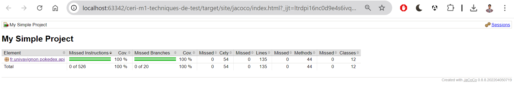

BRAHIMI Farouk.  
Groupe IA Classique.  

| CircleCi   |  |
|------------|------------------------------------------------------------------------------------------------------------------------------------------------------------------------------------------------------------------------------------------------------------|
| Checkstyle |                                                                                                                                                                           |
| Codcov     |                                                                                                                                                                                                                                                            |
| JavaDoc    |                                                                                                                                |

Note : Pour Codecov, j'ai rencontré des problèmes de configuration avec la plateforme que je n'ai pas pu résoudre. Cependant,
la couverture de code de mon projet est de 100 %, comme l'indique la capture d'écran ci-dessous.

# UCE Génie Logiciel Avancé : Techniques de tests

## Introduction

Vous allez à travers ces projet mettre en application une partie des aspects évoqués en cours vis à vis des techniques de tests.  
Pour cela nous allons réaliser un projet logiciel de petite taille, en suivant la roadmap suivante : 
- Setup du projet
- Mise en place des outils d’intégration continue
- Écriture des tests unitaires
- Écriture des mocks, et validation des tests
- Développement dirigé par les tests
- Documentation et conventions de style
- Test d'une implémentation donnée

Durant cette série de TPs, le gestionnaire de version Git sera utilisé à foison, à travers la plateforme GitHub. Si vous n’êtes pas à l’aise avec cet outil[^1], [voici](http://rogerdudler.github.io/git-guide/) un petit guide à garder sous la main.

## Sujets

L'ensemble des sujets de TPs peut être trouvé dans le dossier `TPs`.

Le dossier `src` contient la définition de l'ensemble des interfaces qui seront l'objet de vos travaux.

## Rendus

Le rendu des TPs se fait au rythme suivant :

- TP1 : 2ème séance
- TP2 : 2ème séance
- TP3 : 3ème séance
- TP4 : 5ème séance
- TP5 : dernière séance
- TP6 : dernière séance

Pour chaque rendu vous devez créer un tag à partir du commit qui correspond à la complétion du TP.  
Si vous ne spécifiez pas de tag, le dernier commit à la date-heure de la fin de séance sera celui considéré.

[^1]: Si vous n’êtes vraiment pas à l’aise avec cet outil nous vous conseillons quand même vivement de vous y mettre.
